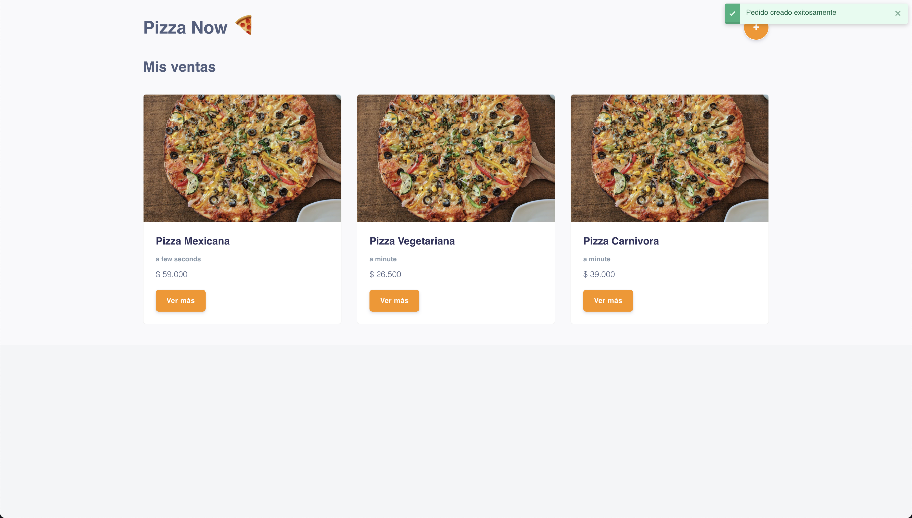

# PIZZA NOW

[Ver sitio](https://fervent-ramanujan-848ade.netlify.app/)

Este proyecto está realizado con [Create React App Typescript](https://create-react-app.dev/docs/adding-typescript/).

En él podrás generar una orden de pizza a tu gusto y totalmente personalizable y un dashboard inicial en el que podrás tener el historico de tus ventas como restaurante.

## Scripts Disponibles

Para correr este proyecto puedes usar:

### `yarn start`

Para iniciar la app en modo desarrollo abriendo [http://localhost:3000](http://localhost:3000) en tu navegador.

### `yarn test`

Para ejecutar los sets de pruebas.

### `yarn build`

Para construir la aplicación en modo producción.

## Librerias usadas

| Libreria                                                                            |                                      Uso                                      |
| ----------------------------------------------------------------------------------- | :---------------------------------------------------------------------------: |
| [Redux](https://redux.js.org/)                                                      |                                 Estado Global                                 |
| [React hook form](https://react-hook-form.com/api)                                  |        Manejo de esados dentro del formulario para evitar re rendering        |
| [react-step-wizard](https://www.npmjs.com/package/react-step-wizard)                |         Permite crear compontes wizard especialmente para formularios         |
| [React Router](https://reactrouter.com/)                                            | Permite crear una navegación dentro de la aplicación web de forma declarativa |
| [Styled Components](https://styled-components.com/)                                 |                 Libreria para crear estilos usando JavaScript                 |
| [Reactstrap](https://reactstrap.github.io/)                                         |                        Libreria UI basada en Bootstrap                        |
| [Jest](https://reactstrap.github.io/)                                               |                             Framework de pruebas                              |
| [React Toast Notification](https://www.npmjs.com/package/react-toast-notifications) |         Libreria que permite generar notificaciones toast estilizadas         |
| [Enzyme](https://enzymejs.github.io/enzyme/)                                        |         Utilidad para pruebas Unitarias en React, complementa a Jest          |

## Explicación

Este proyecto consta de una configuación base de rutas para la navegación entre los dos diferentes portales así como cuenta con dos reducers bases que completan el flujo de la información dentro de la aplicación.

Estos reducers se encargan de la creación de las ordenes y del historico de las mismas. Esta no contiene ningún almacenamiento en caché o local por lo cual su uso es meramente dentro del aplicativo.
